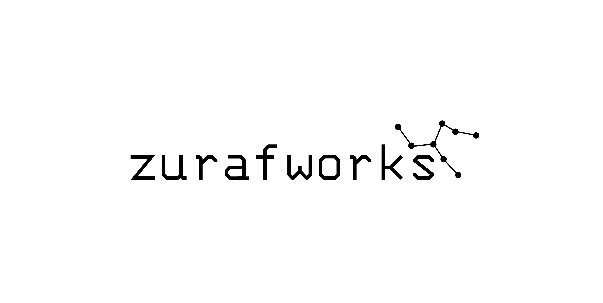

 

  
  <h3 align="center">DersNet Project
</h3>

## 💻 About The Project

DersNet is an online learning platform where students can purchase the educational packages they desire. Within these packages, they can enhance their education with live lessons, lesson recordings, progress assessment tests, and mock exams. DersNet aims to be a digital bridge between students and teachers. By tracking students' progress and development, it identifies their areas of weakness and offers new programs to guide them in those areas.

### Built With

### Prerequisites

- .NET 8

## ⚖️ License

Distributed under the MIT License. See `LICENSE` for more information.

## 📧 Contact

**Web Site:** [https://zurafworks.com](https://zurafworks.com/)

<!-- ## 🙏 Acknowledgements
-  -->